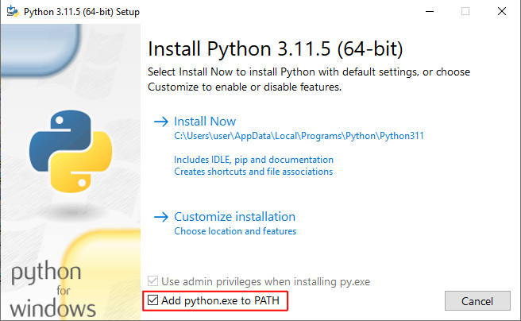
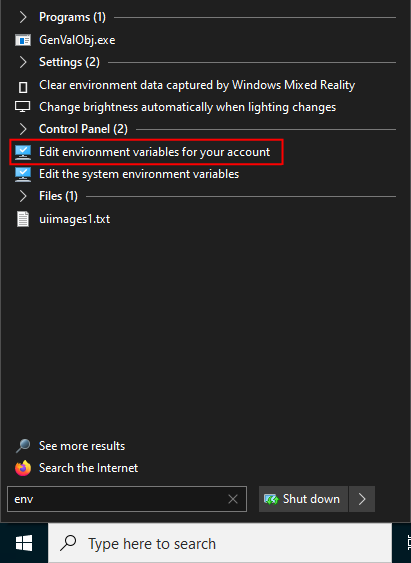
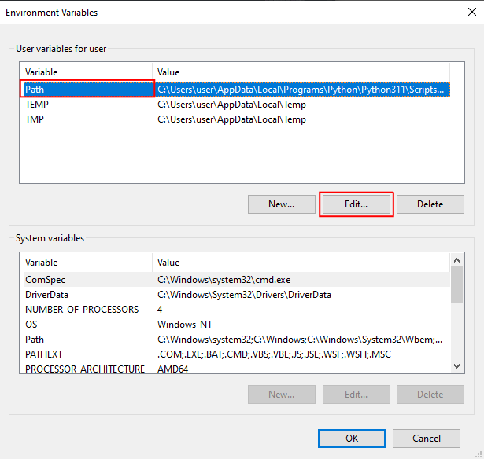
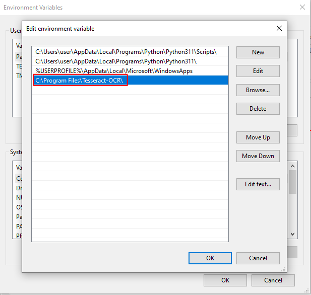

# PoE unique item matcher

A project aimed at detecting unique items on screen for PoE research purposes.

## A note on accuracy and resolution

For the best accuracy, you have to play PoE in 1920x1080px. If you supply
unique matcher with a slightly different image dimension (say 1924x1072px)
it will still likely work. Other resolutions are currently not supported.

## Installation

### Linux

You need Python 3.11+ and [Poetry](https://github.com/python-poetry/poetry).

1. Install poetry: `pip3 install --user poetry`
2. Install project dependencies: `poetry install`
3. Enter Poetry shell: `poetry shell`

### Tesseract

This program requires `tesseract` to be available at your system.
Refer to the [official installation guide](https://tesseract-ocr.github.io/tessdoc/Installation.html) to install it.

### GNOME/Wayland

On Gnome/Wayland you'll have to endure the constant flash effect during screenshotting
until [this](https://gitlab.gnome.org/GNOME/gnome-shell/-/issues/3866) is implemented.

### Windows

#### 1. Install Python 3.11

- Download and install https://www.python.org/ftp/python/3.11.5/python-3.11.5-amd64.exe
- During installation, check the **"Add Python 3.11 to PATH"**



You can verify the installation is correct by opening Command Prompt and running: `python --version`

#### 2. Install Tesseract OCR

- Download and install https://github.com/UB-Mannheim/tesseract/wiki#tesseract-installer-for-windows
- You don't have to check any extra scripts or languages
- Add Tesseract to PATH





## Development

### Running tests

Run `tox -e pytest` to run unit tests. It *will* take a long time.

To run a single test, you can do for example:

```bash
pytest -v tests/test_matcher.py::test_get_base_name
```

To specify the testing data set to use, set `DATA_SET` environment variable
to the desired name. For example, to run the `example` data set:

```bash
DATA_SET=example pytest -v -n auto tests/test_matcher.py::test_find_item_contains_item
```

### Obtaining test data

Test data are currently hosted outside of this repository due to their size.
A full HD png screenshot is anywhere from 2MB to 4MB, multiply by 100 screenshots,
you get 200MB+ of files.

TODO: Provide links to data sets
